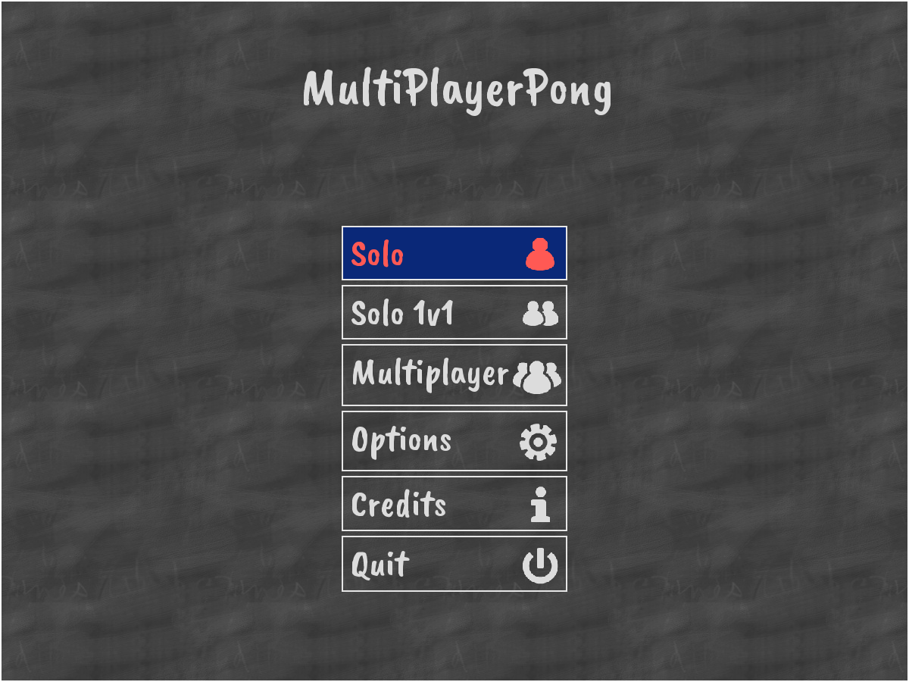

# MultiPlayer Pong

The pong game, in multiplayer, using sfml

Dependencies
---
- SFML (2.5.0)
- Qmake (3.1)
- QtCore (5.10.1)
- Box2D (2.3.1)

Compiling
---------

To compile the server, execute `qmake server.pro` then `make`. The server is now accessible to `bin/server/pong`.

To compile the client, execute `qmake client.pro` then `make`. The client is now accessible to `bin/client/pong`. You might need to move the resources needed by the program (font and music) to the binary folder.

On window, sfml is linked statically, but the file openal32.dll must in the same folder as the .exe file

Screenshots
-----------

